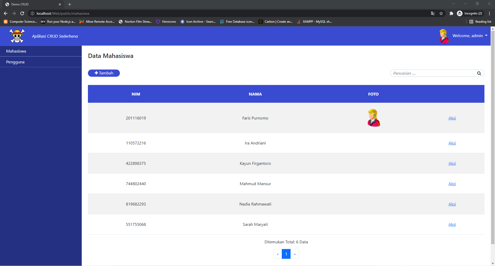
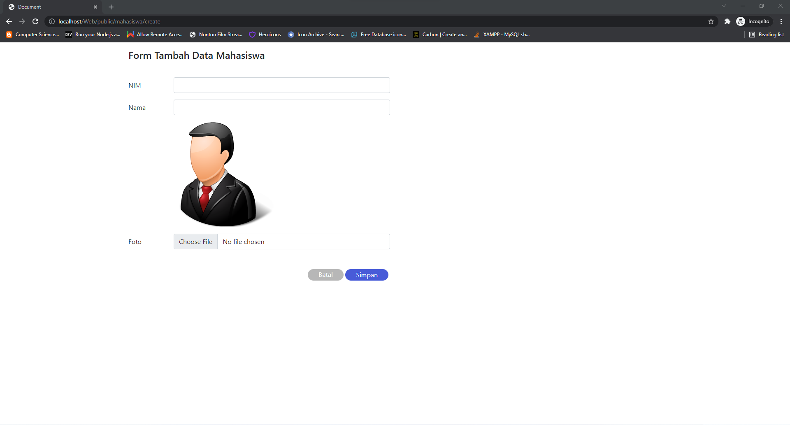
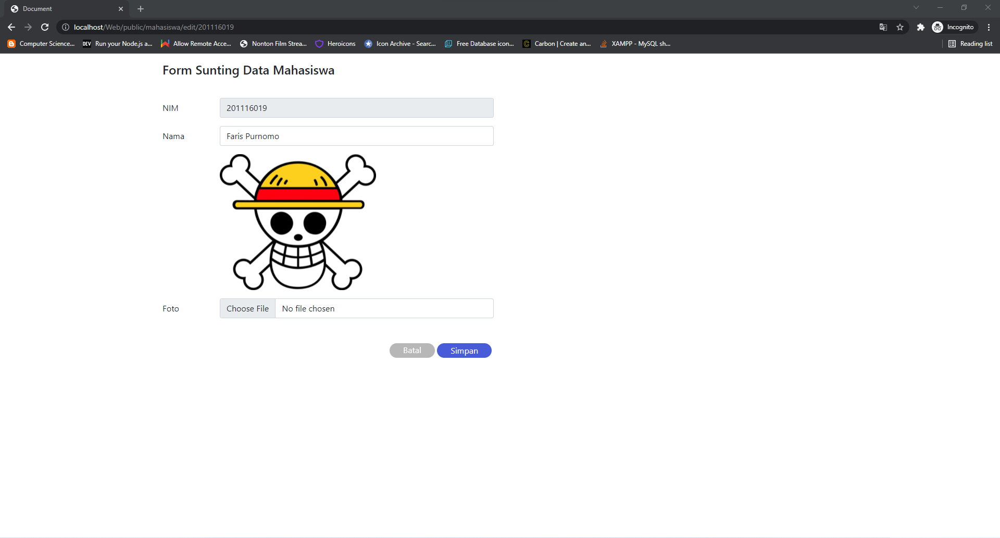
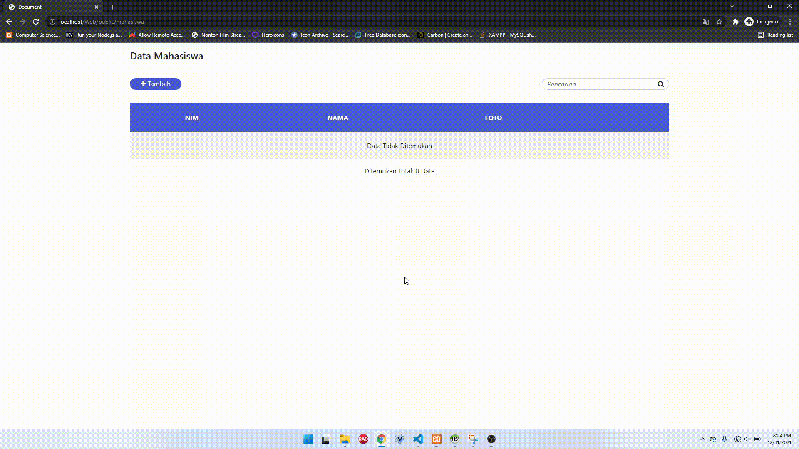

# CRUD dengan MVC PHP native

>## Deskripsi

Aplikasi CRUD sederhana menggunakan PHP. Aplikasi ini dikembangkan menggunakan PHP 7.4.8

 

>## Instalasi
<ol>
    <li>Siapkan Xampp / sejenis dengan rekomendasi versi PHP > 7.3</li>
    <li>Pindah Project ini ke folder htdocs / sejenisnya</li>
    <li>Import database yang terdapat di dalam folder <code>./db</code></li>
    <li>Sesuaikan konfigurasi aplikasi yang terdapat di dalam file <code>./config/Common.php</code> dengan server anda</li>
</ol>

 

>## Screenshot

 

>## Demo
